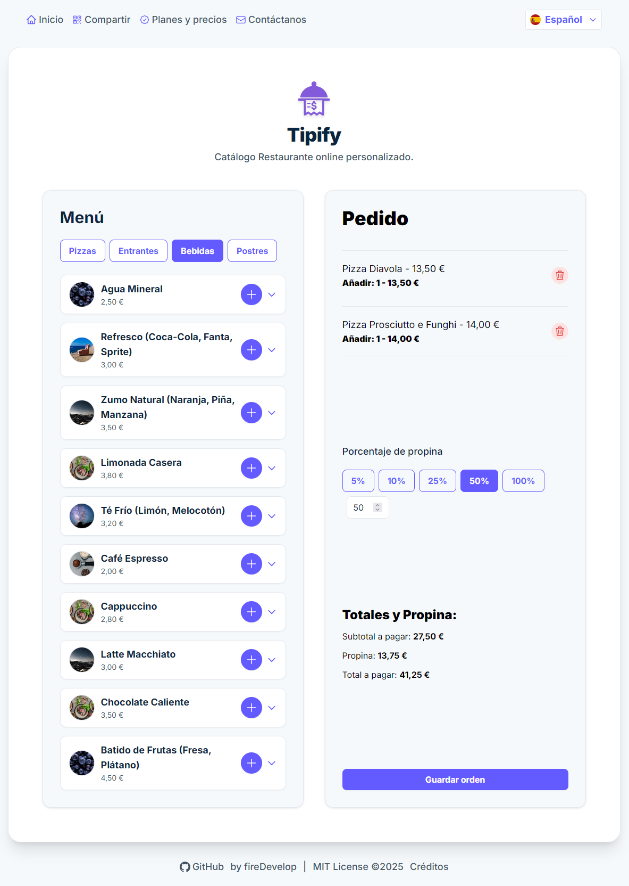
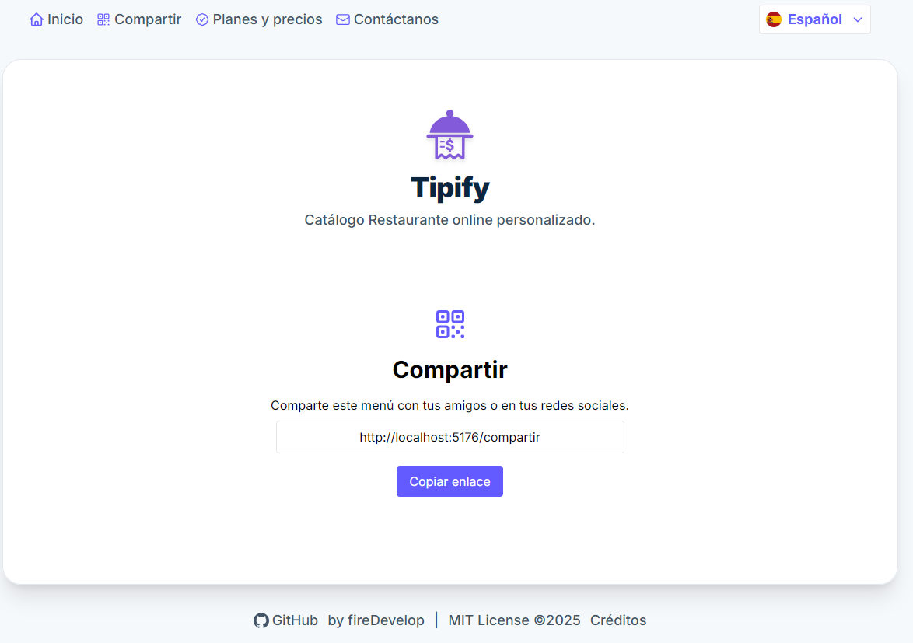
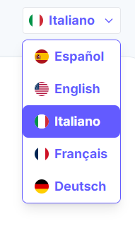
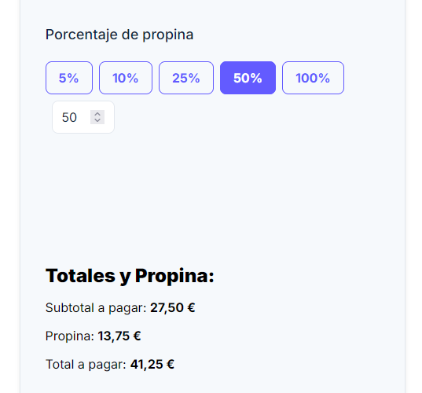

<p align="center">
  
  
  
  
  
  
  

</p>

<p align="center">
  
</p>

<h1 align="center">Tipify</h1>

<p align="center">
  
  
  
  
  
  
  
</p>

[🇪🇸 Español](#español) | [🇬🇧 English](#english)

---

# English

**Tipify** is a professional web application for digitizing restaurant menus and orders, built with React and TypeScript. It enables restaurants to manage their catalog, receive online orders, and display products in multiple languages. Tipify is designed to be easily installed and configured by the Tipify team, offering a turnkey solution for restaurant digitalization.

---

## Features

- **Multilingual digital menu** (Spanish, English, French, German, Italian)
- **Product and order management**
- **Scalable pricing plans**
- **Support for tips and payments**
- **Modern, responsive interface**
- **Assisted installation and configuration**
- **Contact and request installation from the app**
- **Full internationalization (i18n)**
- **Reusable, strongly-typed components with TypeScript**
- **Protected routes and navigation with React Router**

---

## Technologies

- **React** (v18+)
- **TypeScript**
- **Tailwind CSS** (modern, adaptive styles)
- **React Router**
- **Vite** (fast development environment)
- **i18n** (multilanguage support)

---

## Installation

```bash
# Clone the repository
git clone https://github.com/firedevelop/Tipify.git
cd Tipify

# Install dependencies
npm install

# Run in development mode
npm run dev
```

---

## Project Structure

```
src/
  components/      # Reusable components (OrderContents, TipPercentageForm, etc.)
  pages/           # Main pages (Plans, Contact, Credits, Compartir, OrderConfirmation)
  i18n/            # Translation files per language
  App.tsx          # Main component and routes
  index.tsx        # Entry point
public/
  ...              # Static resources
```

---

## How Tipify Works

1. **The restaurant chooses a plan** from the pricing page.
2. **Requests installation** via the contact form or plan button.
3. **The Tipify team installs, configures, and puts online** the restaurant's digital menu in less than 24 hours.
4. The restaurant can **manage products, receive orders and payments** from the app.

---

## Customization & Scalability

- Texts and plans can be easily adapted from translation files.
- The component system allows adding new features and pages.
- The design is fully responsive for any device.

---
## Convert JPG 2 WebP
```bash
sudo apt update
sudo apt install webp
```
convert folder and subfolders
```bash
#!/bin/bash

find . -type f -name "*.jpg" -print0 | while IFS= read -r -d $'\0' file; do
    dir=$(dirname "$file")
    filename=$(basename "$file" .jpg)
    cwebp "$file" -o "${dir}/${filename}.webp"
done
```

only actual folder
```bash
for file in *.jpg; do
    filename=$(basename "$file" .jpg)
    cwebp "$file" -o "${filename}.webp"
done
``` 

---

## License and credits

[MIT License details](#license)


---

# Español

**Tipify** es una aplicación web profesional para digitalizar menús y pedidos en restaurantes, desarrollada con React y TypeScript. Permite a los restaurantes gestionar su catálogo, recibir pedidos online y mostrar sus productos en varios idiomas. Este proyecto está pensado para ser fácilmente instalable y configurable por el equipo de Tipify, ofreciendo una solución llave en mano para la digitalización de restaurantes.

---

## Características principales

- **Menú digital multilingüe** (español, inglés, francés, alemán, italiano)
- **Gestión de productos y pedidos**
- **Planes de precios escalables**
- **Soporte para propinas y pagos**
- **Interfaz moderna y responsive**
- **Instalación y configuración asistida**
- **Contactar y solicitar instalación desde la app**
- **Internacionalización (i18n) completa**
- **Componentes reutilizables y tipados con TypeScript**
- **Rutas protegidas y navegación con React Router**

---

## Tecnologías utilizadas

- **React** (v18+)
- **TypeScript**
- **Tailwind CSS** (estilos modernos y adaptativos)
- **React Router**
- **Vite** (entorno de desarrollo rápido)
- **i18n** (soporte multilenguaje)

---

## Instalación y ejecución

```bash
# Clona el repositorio
git clone https://github.com/firedevelop/Tipify.git
cd Tipify

# Instala las dependencias
npm install

# Ejecuta en modo desarrollo
npm run dev
```

---

## Estructura del proyecto

```
src/
  components/      # Componentes reutilizables (OrderContents, TipPercentageForm, etc.)
  pages/           # Páginas principales (Plans, Contact, Credits, Compartir, OrderConfirmation)
  i18n/            # Archivos de traducción por idioma
  App.tsx          # Componente principal y rutas
  index.tsx        # Punto de entrada
public/
  ...              # Recursos estáticos
```

---

## Cómo funciona Tipify

1. **El restaurante elige un plan** desde la página de precios.
2. **Solicita la instalación** mediante el formulario de contacto o el botón de cada plan.
3. **El equipo de Tipify instala, configura y pone online** el menú digital del restaurante en menos de 24h.
4. El restaurante puede **gestionar productos, recibir pedidos y pagos** desde la app.

---

## Personalización y escalabilidad

- Los textos y planes pueden adaptarse fácilmente desde los archivos de traducción.
- El sistema de componentes permite añadir nuevas funcionalidades y páginas.
- El diseño es adaptable a cualquier dispositivo.

---

## Convertir images a webp
```
sudo apt update
sudo apt install webp
```
convert folder and subfolders
```
#!/bin/bash
find . -type f -name "*.jpg" -print0 | while IFS= read -r -d $'\0' file; do
    dir=$(dirname "$file")
    filename=$(basename "$file" .jpg)
    cwebp "$file" -o "${dir}/${filename}.webp"
done
```

only actual folder
```
for file in *.jpg; do
    filename=$(basename "$file" .jpg)
    cwebp "$file" -o "${filename}.webp"
done
``` 

---


# License

This project is licensed under the MIT License.


### Pizzas

Photo by <a href="https://unsplash.com/@aurel__lens?utm_content=creditCopyText&utm_medium=referral&utm_source=unsplash">Aurélien Lemasson-Théobald</a> on <a href="https://unsplash.com/photos/round-cooked-pizza-x00CzBt4Dfk?utm_content=creditCopyText&utm_medium=referral&utm_source=unsplash">Unsplash</a>

Photo by <a href="https://unsplash.com/@amir_v_ali?utm_content=creditCopyText&utm_medium=referral&utm_source=unsplash">amirali mirhashemian</a> on <a href="https://unsplash.com/photos/pizza-with-green-leaves-and-red-sauce-XtLPfib7OuM?utm_content=creditCopyText&utm_medium=referral&utm_source=unsplash">Unsplash</a>
      
Photo by <a href="https://unsplash.com/@louishansel?utm_content=creditCopyText&utm_medium=referral&utm_source=unsplash">Louis Hansel</a> on <a href="https://unsplash.com/photos/cooked-food-on-round-white-ceramic-plate-cC0_UO1Obg4?utm_content=creditCopyText&utm_medium=referral&utm_source=unsplash">Unsplash</a>
      
Photo by <a href="https://unsplash.com/@louishansel?utm_content=creditCopyText&utm_medium=referral&utm_source=unsplash">Louis Hansel</a> on <a href="https://unsplash.com/photos/cooked-food-on-round-white-ceramic-plate-cC0_UO1Obg4?utm_content=creditCopyText&utm_medium=referral&utm_source=unsplash">Unsplash</a>

Photo by <a href="https://unsplash.com/@alanaktion?utm_content=creditCopyText&utm_medium=referral&utm_source=unsplash">Alan Hardman</a> on <a href="https://unsplash.com/photos/pepperoni-pizza-SU1LFoeEUkk?utm_content=creditCopyText&utm_medium=referral&utm_source=unsplash">Unsplash</a>

Photo by <a href="https://unsplash.com/@saahilkhatkhate?utm_content=creditCopyText&utm_medium=referral&utm_source=unsplash">Saahil Khatkhate</a> on <a href="https://unsplash.com/photos/pizza-on-brown-wooden-table-kfDsMDyX1K0?utm_content=creditCopyText&utm_medium=referral&utm_source=unsplash">Unsplash</a>

Photo by <a href="https://unsplash.com/@saundiii?utm_content=creditCopyText&utm_medium=referral&utm_source=unsplash">Saundarya Srinivasan</a> on <a href="https://unsplash.com/photos/pizza-with-green-leaves-on-top-60nzTP7_hMQ?utm_content=creditCopyText&utm_medium=referral&utm_source=unsplash">Unsplash</a>

Photo by <a href="https://unsplash.com/@mafimo?utm_content=creditCopyText&utm_medium=referral&utm_source=unsplash">Masimo Grabar</a> on <a href="https://unsplash.com/photos/baked-pizza-NzHRSLhc6Cs?utm_content=creditCopyText&utm_medium=referral&utm_source=unsplash">Unsplash</a>
      
Photo by <a href="https://unsplash.com/@jkakaroto?utm_content=creditCopyText&utm_medium=referral&utm_source=unsplash">Jonas Kakaroto</a> on <a href="https://unsplash.com/photos/pepperoni-pizz-zlKdLdMREtE?utm_content=creditCopyText&utm_medium=referral&utm_source=unsplash">Unsplash</a>

Photo by <a href="https://unsplash.com/@shouravsheikh?utm_content=creditCopyText&utm_medium=referral&utm_source=unsplash">Shourav Sheikh</a> on <a href="https://unsplash.com/photos/pizza-with-pepperoni-and-cheese-on-orange-table-xLfqx4Psf94?utm_content=creditCopyText&utm_medium=referral&utm_source=unsplash">Unsplash</a>
      

      
### Starters
Photo by <a href="https://unsplash.com/@hybridstorytellers?utm_content=creditCopyText&utm_medium=referral&utm_source=unsplash">Hybrid Storytellers</a> on <a href="https://unsplash.com/photos/a-table-topped-with-plates-of-food-covered-in-sauce-X0R1I9uh33w?utm_content=creditCopyText&utm_medium=referral&utm_source=unsplash">Unsplash</a>
      
Photo by <a href="https://unsplash.com/@fotosdealimentos?utm_content=creditCopyText&utm_medium=referral&utm_source=unsplash">Fotografía de Alimentos</a> on <a href="https://unsplash.com/photos/a-wooden-table-topped-with-a-plate-of-food-and-chopsticks-WPHDpITnv9Q?utm_content=creditCopyText&utm_medium=referral&utm_source=unsplash">Unsplash</a>

Photo by <a href="https://unsplash.com/@omertahacetin?utm_content=creditCopyText&utm_medium=referral&utm_source=unsplash">Ömer Taha Çetin</a> on <a href="https://unsplash.com/photos/a-plate-of-food-on-a-wooden-table-3t6uv-c-xys?utm_content=creditCopyText&utm_medium=referral&utm_source=unsplash">Unsplash</a>

Photo by <a href="https://unsplash.com/@1clickaf?utm_content=creditCopyText&utm_medium=referral&utm_source=unsplash">1Click</a> on <a href="https://unsplash.com/photos/a-close-up-of-a-plate-of-food-on-a-table-wXYlh6KJqG0?utm_content=creditCopyText&utm_medium=referral&utm_source=unsplash">Unsplash</a>

Photo by <a href="https://unsplash.com/@fryfamilyfoodco?utm_content=creditCopyText&utm_medium=referral&utm_source=unsplash">The Fry Family Food Co.</a> on <a href="https://unsplash.com/photos/a-tray-of-food-with-chopsticks-and-dipping-sauce-enryqd8xpIQ?utm_content=creditCopyText&utm_medium=referral&utm_source=unsplash">Unsplash</a>

Photo by <a href="https://unsplash.com/@fayyazkh?utm_content=creditCopyText&utm_medium=referral&utm_source=unsplash">FAYYAZ KH</a> on <a href="https://unsplash.com/photos/vegetable-salad-with-sliced-fried-chicken-in-square-black-bowl-sr18nRcaGT0?utm_content=creditCopyText&utm_medium=referral&utm_source=unsplash">Unsplash</a>

Photo by <a href="https://unsplash.com/@karina_brovchenko?utm_content=creditCopyText&utm_medium=referral&utm_source=unsplash">Karina B.</a> on <a href="https://unsplash.com/photos/a-red-bowl-filled-with-meat-and-vegetables-T8EZ42yL8VM?utm_content=creditCopyText&utm_medium=referral&utm_source=unsplash">Unsplash</a>

Photo by <a href="https://unsplash.com/@anil_sharma_india?utm_content=creditCopyText&utm_medium=referral&utm_source=unsplash">Anil Sharma</a> on <a href="https://unsplash.com/photos/a-black-plate-topped-with-fried-food-on-top-of-a-counter-AAOZNDwsTuY?utm_content=creditCopyText&utm_medium=referral&utm_source=unsplash">Unsplash</a>

Photo by <a href="https://unsplash.com/@lingchor?utm_content=creditCopyText&utm_medium=referral&utm_source=unsplash">Lingchor</a> on <a href="https://unsplash.com/photos/brown-cookies-on-black-ceramic-plate-PG5W85aaC4k?utm_content=creditCopyText&utm_medium=referral&utm_source=unsplash">Unsplash</a>
                                                

### Drinks
Photo by <a href="https://unsplash.com/@whitney_wright?utm_content=creditCopyText&utm_medium=referral&utm_source=unsplash">Whitney Wright</a> on <a href="https://unsplash.com/photos/three-clear-drinking-glasses-filled-with-juice-TgQkxQc-t_U?utm_content=creditCopyText&utm_medium=referral&utm_source=unsplash">Unsplash</a>

Photo by <a href="https://unsplash.com/@lgnwvr?utm_content=creditCopyText&utm_medium=referral&utm_source=unsplash">LOGAN WEAVER | @LGNWVR</a> on <a href="https://unsplash.com/photos/clear-drinking-glass-with-ice-cubes-and-sliced-of-tomato-B9lUt97FL9I?utm_content=creditCopyText&utm_medium=referral&utm_source=unsplash">Unsplash</a>

Photo by <a href="https://unsplash.com/@edwardhowellphotography?utm_content=creditCopyText&utm_medium=referral&utm_source=unsplash">Edward Howell</a> on <a href="https://unsplash.com/photos/clear-wine-glass-with-orange-liquid-jNs7IPdt4HQ?utm_content=creditCopyText&utm_medium=referral&utm_source=unsplash">Unsplash</a>

Photo by <a href="https://unsplash.com/@kekse_und_ich?utm_content=creditCopyText&utm_medium=referral&utm_source=unsplash">Svitlana</a> on <a href="https://unsplash.com/photos/a-drink-with-a-garnish-garnish-garnish-garnish-w7dlfv2BWvs?utm_content=creditCopyText&utm_medium=referral&utm_source=unsplash">Unsplash</a>

Photo by <a href="https://unsplash.com/@heftiba?utm_content=creditCopyText&utm_medium=referral&utm_source=unsplash">Toa Heftiba</a> on <a href="https://unsplash.com/photos/fruit-juice-cups-beside-yellow-bananas-on-plate-yFLd5x6vfYM?utm_content=creditCopyText&utm_medium=referral&utm_source=unsplash">Unsplash</a>
      
Photo by <a href="https://unsplash.com/@iamhogir?utm_content=creditCopyText&utm_medium=referral&utm_source=unsplash">Hogir saeed</a> on <a href="https://unsplash.com/photos/a-smoothie-with-kiwi-slices-on-top-of-it-wN01KQVMAIQ?utm_content=creditCopyText&utm_medium=referral&utm_source=unsplash">Unsplash</a>

Photo by <a href="https://unsplash.com/@giorgiiremadze?utm_content=creditCopyText&utm_medium=referral&utm_source=unsplash">Giorgi Iremadze</a> on <a href="https://unsplash.com/photos/green-liquid-in-clear-drinking-glass-with-straw-3OV0ft7mG_o?utm_content=creditCopyText&utm_medium=referral&utm_source=unsplash">Unsplash</a>

Photo by <a href="https://unsplash.com/@dibaglin?utm_content=creditCopyText&utm_medium=referral&utm_source=unsplash">ShengGeng Lin</a> on <a href="https://unsplash.com/photos/macro-shot-photography-of-mug-MLxu9kE082c?utm_content=creditCopyText&utm_medium=referral&utm_source=unsplash">Unsplash</a>

Photo by <a href="https://unsplash.com/@dibaglin?utm_content=creditCopyText&utm_medium=referral&utm_source=unsplash">ShengGeng Lin</a> on <a href="https://unsplash.com/photos/sliced-watermelon-with-lemon-on-shot-glass-XoN3v3Ge7EE?utm_content=creditCopyText&utm_medium=referral&utm_source=unsplash">Unsplash</a>

Photo by <a href="https://unsplash.com/@edwardhowellphotography?utm_content=creditCopyText&utm_medium=referral&utm_source=unsplash">Edward Howell</a> on <a href="https://unsplash.com/photos/clear-drinking-glass-with-orange-juice-3wTB8cwSmzE?utm_content=creditCopyText&utm_medium=referral&utm_source=unsplash">Unsplash</a>


### Desserts
Photo by <a href="https://unsplash.com/@joyfulcaptures?utm_content=creditCopyText&utm_medium=referral&utm_source=unsplash">Joyful</a> on <a href="https://unsplash.com/photos/strawberry-and-banana-on-white-ceramic-plate-vT5xrj3z1OE?utm_content=creditCopyText&utm_medium=referral&utm_source=unsplash">Unsplash</a>

Photo by <a href="https://unsplash.com/@kobbymendez?utm_content=creditCopyText&utm_medium=referral&utm_source=unsplash">Kobby Mendez</a> on <a href="https://unsplash.com/photos/white-ice-cream-on-brown-cookie-idTwDKt2j2o?utm_content=creditCopyText&utm_medium=referral&utm_source=unsplash">Unsplash</a>

Photo by <a href="https://unsplash.com/@kaaficlever?utm_content=creditCopyText&utm_medium=referral&utm_source=unsplash">Shivansh Sethi</a> on <a href="https://unsplash.com/photos/chocolate-cake-with-white-icing-on-white-ceramic-plate-dKT6Q7q2UKs?utm_content=creditCopyText&utm_medium=referral&utm_source=unsplash">Unsplash</a>

Photo by <a href="https://unsplash.com/@emilembunzama?utm_content=creditCopyText&utm_medium=referral&utm_source=unsplash">Emile Mbunzama</a> on <a href="https://unsplash.com/photos/oreo-cookie-sandwiches-dessert-in-short-stem-glass-cLpdEA23Z44?utm_content=creditCopyText&utm_medium=referral&utm_source=unsplash">Unsplash</a>
      
Photo by <a href="https://unsplash.com/@maryamo?utm_content=creditCopyText&utm_medium=referral&utm_source=unsplash">Maryam Abubakar</a> on <a href="https://unsplash.com/photos/a-cookie-in-a-jar-with-sprinkles-and-sprinkles-IDq4UVk-q1k?utm_content=creditCopyText&utm_medium=referral&utm_source=unsplash">Unsplash</a>

Photo by <a href="https://unsplash.com/@heatherbarnes?utm_content=creditCopyText&utm_medium=referral&utm_source=unsplash">Heather Barnes</a> on <a href="https://unsplash.com/photos/macarons-on-table-WbZesfqwR-A?utm_content=creditCopyText&utm_medium=referral&utm_source=unsplash">Unsplash</a>

Photo by <a href="https://unsplash.com/@dilja96?utm_content=creditCopyText&utm_medium=referral&utm_source=unsplash">Diliara Garifullina</a> on <a href="https://unsplash.com/photos/strawberry-and-banana-on-white-ceramic-plate-Gx_vsiMRgzk?utm_content=creditCopyText&utm_medium=referral&utm_source=unsplash">Unsplash</a>

Photo by <a href="https://unsplash.com/@nahimaaparicio?utm_content=creditCopyText&utm_medium=referral&utm_source=unsplash">Nahima Aparicio</a> on <a href="https://unsplash.com/photos/a-white-plate-topped-with-a-waffle-covered-in-fruit-nuKLmJUO1Is?utm_content=creditCopyText&utm_medium=referral&utm_source=unsplash">Unsplash</a>

Photo by <a href="https://unsplash.com/@alexlvrs?utm_content=creditCopyText&utm_medium=referral&utm_source=unsplash">Alex Lvrs</a> on <a href="https://unsplash.com/photos/round-sliced-pie-with-cream-aX_ljOOyWJY?utm_content=creditCopyText&utm_medium=referral&utm_source=unsplash">Unsplash</a>

Photo by <a href="https://unsplash.com/@luisanazl?utm_content=creditCopyText&utm_medium=referral&utm_source=unsplash">luisana zerpa</a> on <a href="https://unsplash.com/photos/white-and-red-cupcake-with-white-icing-on-top-MJPr6nOdppw?utm_content=creditCopyText&utm_medium=referral&utm_source=unsplash">Unsplash</a>

